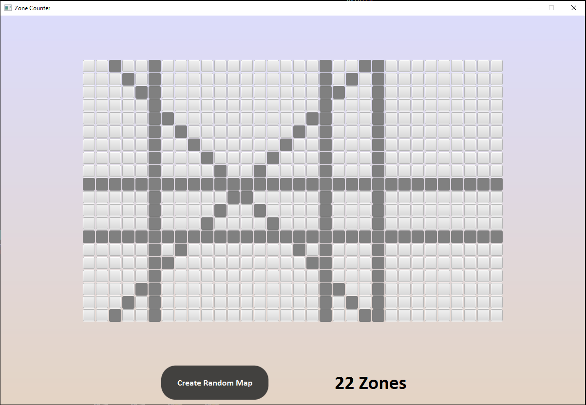

# Find Zones
## İts simple project that counts the geographical regions on a given map using Java with JavaFX.
#### Each time the "Create Random Map" button is clicked, a random map will be loaded on the screen and the number of regions on the map will be printed.

